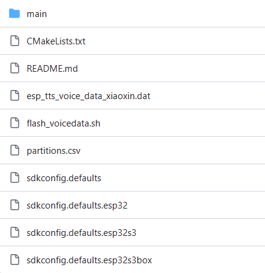
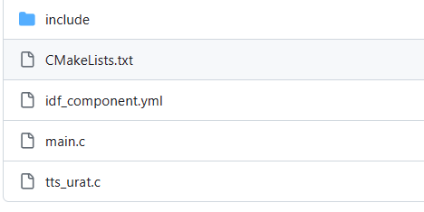
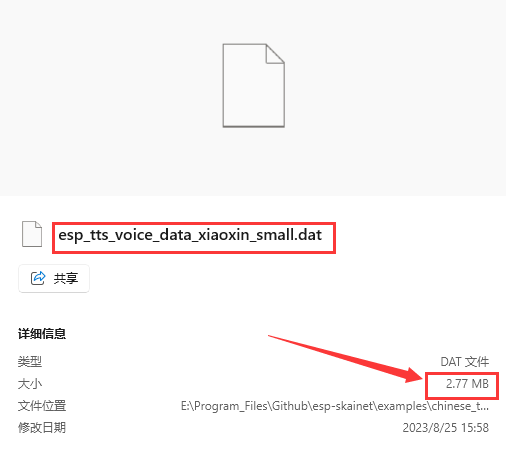
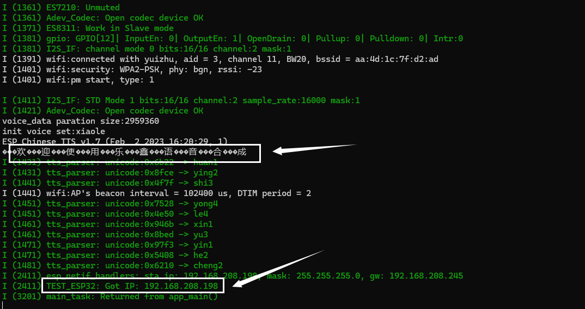

- [esp32\_korvo+chinese\_tts](#esp32_korvochinese_tts)
  - [前言](#前言)
  - [Chinese\_TTS示例详细说明](#chinese_tts示例详细说明)
  - [Chinese\_tts移植功能](#chinese_tts移植功能)
    - [移植Wifi功能](#移植wifi功能)
      - [遇到的问题](#遇到的问题)
      - [具体流程](#具体流程)


# esp32_korvo+chinese_tts
## 前言
我们知道esp-korvo是乐鑫专门为语音开发设计的开发板，但是我不是很建议使用这一块板子进行开发，移植难度较大，可能是我太菜的缘故，但是既然手头上有他，那就开发看看

开发环境：ESP-IDF v5.1.2  
硬件型号：ESP32-Korvo V1.1  
芯片型号：ESP32-WROVER-E 
> ESP32-WROVER-E 这款 ESP32 模组内置 ESP32-D0WD-V3 芯片、16 MB flash 和 8 MB PSRAM，可灵活存储数据，具有 Wi-Fi / BT 连接和数据处理能力。
    

## Chinese_TTS示例详细说明

我们在拿到板子后，在搜索引擎中输入esp-korvo，会看到一个GitHub的用户手册，说实话他只是做了一些简单的硬件说明，和示例怎么用，具体的文件在esp_skainet的example中也没有进行详细的说明，所以在进行开发的时候上手难度较高。

我这边对chinese_tts示例中的文件做详细的说明，为后续的移植铺垫。

我们在打开`esp_skainet/example/chinese_tts`，会看到如下目录结构（我clone的项目编译过了，这里放没有编译过的）  


这里我门需要关心两个文件，一个 CMakeLists.txt ，一个是 partitions.csv 。  
> CMakeLists.txt : CMake编译文件  
> partitions.csv : esp32-flash分区表  

目前这两个我们可以会去修改 partitions.csv ，因为我们可能需要重新分配esp32的SPIflash空间。CMakeLists我门不需要去动他，他是用来编译整个工程的，保持原样。

接下来我们进入到main文件夹中，看看其中有什么。  
  
> include : 包含tts_uart.h
> CMakeLists.txt ： main文件夹的编译信息
> idf_compnent.yml : 加载需要使用esp-idf组件的信息
> main.c : 主程序
> ts_uart.c : tts串口功能实现的主程序

现在看来这个工程我们可能需要改动的文件不是很多，在main文件夹中，我们可能需要改动的有CMakeLists.txt，idf_compnent.yml，main.c。这里我重点说明一下`main/CMakeLists.txt `。  

- 先自己打开`chinese_tts/main/CMakeLists.txt`看一下源文件

    好，我们来看看里面的各个代码块具有什么功能
    - 需要编译的.c文件
        ```
        set(srcs
            main.c
            tts_urat.c
            )
        ``` 
    - 设置.c文件需要头文件（.h）路径
        ```
        set(include_dirs 
            include
            )
        ```
    - 设置项目需要的依赖（官方组件）
        ```
        set(requires
            hardware_driver
            sr_ringbuf
            player
            )
        ```
    - 确定 esp-sr 是从组件注册表获取还是从本地路径获取
        ```
        idf_build_get_property(build_components BUILD_COMPONENTS)
        if(esp-sr IN_LIST build_components)
            set(esp-sr_name esp-sr) # Local component
        else()
            set(esp-sr_name espressif__esp-sr) # Managed component
        endif()
        ```
    - 设置获取声音数据的路径
        ```
        idf_component_get_property(esp-sr_path ${esp-sr_name} COMPONENT_DIR)
        set(voice_data_image ${esp-sr_path}/esp-tts/esp_tts_chinese/esp_tts_voice_data_xiaoxin_small.dat)
        add_custom_target(voice_data ALL DEPENDS ${voice_data_image})
        add_dependencies(flash voice_data)

        partition_table_get_partition_info(size "--partition-name voice_data" "size")
        partition_table_get_partition_info(offset "--partition-name voice_data" "offset")

        if("${size}" AND "${offset}")
            esptool_py_flash_to_partition(flash "voice_data" "${voice_data_image}")
        else()
            set(message "Failed to find model in partition table file"
                        "Please add a line(Name=voice_data, Type=data, Size=3890K) to the partition file.")
        endif()
        ```
- 先自己打开`chinese_tts/main/idfcomponent.yml`看一下源文件
    ```
    dependencies:
        espressif/esp-sr: ">=1.1.0,<1.5.0"
    ``` 
    这里我们看到，他使用的了一个外部组件 `esp-sr`。

- 下面我们重点关注一下`chinese_tts/main/main.c`，这里我对示例的sd卡功能不做介绍，目前我还没有进行相关的开发。
  - 解释在源文件里面，我将不需要了解的内容注释掉，保留下来我们需要了解的，我不需要使用uart相关的功能，这里我将他删除掉了，但是你仍可以在clone下的工程里面看到uart功能的相关代码。
    ```c
    //引入头文件
    #include <stdio.h>
    #include <stdlib.h>
    #include <string.h>

    #include "freertos/FreeRTOS.h"
    #include "freertos/task.h"
    #include "esp_system.h"
    #include "esp_tts.h"
    #include "esp_tts_voice_xiaole.h"
    #include "esp_tts_voice_template.h"
    #include "esp_tts_player.h"
    #include "esp_board_init.h"
    #include "ringbuf.h"

    #include "tts_urat.h"

    #include "wav_encoder.h"
    #include "esp_partition.h"
    #include "esp_idf_version.h"

    //#define SDCARD_OUTPUT_ENABLE  //想启用sd卡功能将注释去掉就行

    ringbuf_handle_t urat_rb=NULL;  //初始化一个串口句柄

    // 主程序
    int app_main()
    {
    // #if defined CONFIG_ESP32_S3_EYE_BOARD  // 如果定义了CONFIG_ESP32_S3_EYE_BOARD，这打印不支持
    //     printf("Not Support esp32-s3-eye board\n");
    //     return 0;
    // #endif

        ESP_ERROR_CHECK(esp_board_init(16000, 1, 16));  //初始化板级配置

    #ifdef SDCARD_OUTPUT_ENABLE
        ESP_ERROR_CHECK(esp_sdcard_init("/sdcard", 10));
        FILE* fp=fopen("/sdcard/URAT.pcm", "w+");
        if(fp==NULL)
            printf("can not open file!\n");

        //sample rate:16000Hz, int16, mono
        void * wav_encoder=wav_encoder_open("/sdcard/prompt.wav", 16000, 16, 1);
        void * urat_wav_encoder=wav_encoder_open("/sdcard/URAT.wav", 16000, 16, 1);
    #endif

        /*** 1. create esp tts handle ***/
        // initial voice set from separate voice data partition

        const esp_partition_t* part=esp_partition_find_first(ESP_PARTITION_TYPE_DATA, ESP_PARTITION_SUBTYPE_ANY, "voice_data");  //获取分区表中voice_data，并将一些获取到的信息存储到part结构体指针中（不是分区中的数据，而是esp_partition_t创建的结构体里面所需的信息）
        if (part==NULL) { 
            printf("Couldn't find voice data partition!\n"); 
            return 0;
        } else {
            printf("voice_data paration size:%d\n", part->size);
        }

        void* voicedata; //定义一个voicedata空类型指针

    #if ESP_IDF_VERSION >= ESP_IDF_VERSION_VAL(5, 0, 0)  //如果ESP-IDF版本大于等于5.0.0
        esp_partition_mmap_handle_t mmap;  //定义一个映射句柄
        esp_err_t err=esp_partition_mmap(part, 0, part->size, ESP_PARTITION_MMAP_DATA, &voicedata, &mmap);  // 将part指针存储在flash的分区映射到cpu可以操作的虚拟地址上
    #else //如果ESP-IDF版本小于5.0.0
        spi_flash_mmap_handle_t mmap;
        esp_err_t err=esp_partition_mmap(part, 0, part->size, SPI_FLASH_MMAP_DATA, &voicedata, &mmap);
    #endif

        if (err != ESP_OK) {
            printf("Couldn't map voice data partition!\n"); 
            return 0;
        }
        esp_tts_voice_t *voice=esp_tts_voice_set_init(&esp_tts_voice_template, (int16_t*)voicedata); // 初始化tts所需要的声音数据
        

        esp_tts_handle_t *tts_handle=esp_tts_create(voice);  //创建一个操纵tts的句柄

        /*** 2. play prompt text ***/
        char *prompt1="欢迎使用乐鑫语音合成";  //定义一个字符类型的指针
        printf("%s\n", prompt1);
        if (esp_tts_parse_chinese(tts_handle, prompt1)) {  //将中文文本解析为语音合成所需的音频数据
                int len[1]={0};
                do {
                    short *pcm_data=esp_tts_stream_play(tts_handle, len, 3); //用于播放语音合成的音频流并返回 PCM 数据
    #ifdef SDCARD_OUTPUT_ENABLE
                    wav_encoder_run(wav_encoder, pcm_data, len[0]*2);
    #else
                    esp_audio_play(pcm_data, len[0]*2, portMAX_DELAY);  //通过音频设备或接口播放 PCM 数据
    #endif
                    //printf("data:%d \n", len[0]);
                } while(len[0]>0);
        }
        esp_tts_stream_reset(tts_handle);  //清除之前生成的音频数据并重置语音合成的状态

    #ifdef SDCARD_OUTPUT_ENABLE
        wav_encoder_close(wav_encoder);
    #endif

        return 0;
    }
    ```
好的，你现在已经大致清楚了chinese_tts示例的内容了，下面我们要在其上面实现一些功能了。

## Chinese_tts移植功能

### 移植Wifi功能

#### 遇到的问题
我在移植Wifi的时候，碰到了一个让我巨头疼的问题，但是现在我先不说这个，先说一个小问题
- 问题一：Wifi功能代码移植完成，连接不上
  - 解决办法：更改分区表，添加nvs分区
  - 原分区表
    ```
    # Name,  Type, SubType, Offset,  Size
    factory, app,  factory, 0x010000, 4M
    voice_data, data,  fat, 0x410000, 3890K 
    ``` 
  - 更改后的分区表
    ```
    # Name,  Type, SubType, Offset,  Size
    nvs,     data, nvs,     0x9000,  0x4000
    factory, app,  factory, 0x010000, 4M
    voice_data, data,  fat, 0x410000, 3890K
    ``` 

- 问题二：Wifi连接上，打印出IP地址了，但是出现语音数据映射出错
  - 错误信息  
    > <font color="red"> E (1360) mmap: no such vaddr range </font>  
    > Couldn't map voice data partition!

  - 解决办法：更改分区表，修改`voice_data`的Size
  - 原分区表
    ```
    # Name,  Type, SubType, Offset,  Size
    nvs,     data, nvs,     0x9000,  0x4000
    factory, app,  factory, 0x010000, 4M
    voice_data, data,  fat, 0x410000, 3890K
    ``` 
  - 更改后的分区表  
    ```
    # Name,  Type, SubType, Offset,  Size
    nvs,     data, nvs,     0x9000,  0x4000
    factory, app,  factory, 0x010000, 4M
    voice_data, data,  fat, 0x410000, 2890K
    ```
    至于为什么这么改，我这里简单说明一下  

    我们将语音数据存储到flash中，如果要使用他，需要操作读取flash中的内容，然后将内容存储到全局变量或局部变量中，这样做的话就很麻烦，所以聪明的工程师就想到了一个办法。  

    **将flash中的内容映射到一些虚拟地址！**  

    这样我们就可以通过操作这些虚拟地址来访问对应flash资源，是不是很棒？是的，`chinese_tts`示例中也是将`voice_data`映射虚拟地址来访问。  

    现在你是不是能理解了为什么会出现Couldn't map voice data partition!，我们怎么解决呢？这是我们最关心的。  

    无法成功映射分区可能是以下原因导致：  

    > 1. **地址范围冲突**：确保要映射的分区的地址范围与其他已映射的内存区域不发生冲突。在调用 esp_partition_mmap 之前，检查和避免与其他内存映射区域的地址冲突。  

    > 2. **分区表定义错误**：请再次验证分区表的定义是否正确。确保分区的类型、标识符、起始地址和大小与实际分区的属性相匹配。  

    > 3. **硬件或固件问题**：某些硬件或固件问题可能会导致分区映射失败。请确保您的硬件配置正确，并且使用的固件版本与硬件兼容。如果可能，尝试更新固件或检查与硬件相关的问题。  

    > 4. **内存不足**：如果系统内存不足，可能无法成功映射分区。确保系统有足够的可用内存来容纳要映射的分区。  

    > 5. **权限问题**：某些特殊类型的分区可能需要特定的访问权限才能映射。确保您具有正确的权限来访问和映射相关分区。 

    就上面的5种原因，首先排除硬件或固件问题，然后排除权限问题，这些不是我们要操心的。再然后排除分区表定义错误，esp32再进行烧录前，会检查位于0x8000的分区表，如果你能烧录程序到esp里面，分区表定义就没有问题。

    那么接下来就剩两个问题了，地址范围冲突也不存在，我们要映射的分区启始地址是0x410000，大小是3890K。可以看到程序中除了我们用`esp_partition_mmap(part, 0, part->size, ESP_PARTITION_MMAP_DATA, &voicedata, &mmap);`去映射，没有别的地方去映射这一分区地址，所以不可能存在冲突。

    所以问题出在内存不足，我查看了一下`main/CMakeLists.txt`中使用的语音数据是`esp_tts_voice_data_xiaoxin_small.dat`，可以看到下图，他的大小是2.77MB，所以我将分区大小改为2890K，就解决了！  
    

#### 具体流程

- 首先在main.c中添加以下代码
    ```c
    #include <nvs_flash.h>
    #include <esp_event.h>
    #include <esp_wifi.h>
    #include <esp_netif.h>
    #include <esp_netif_ip_addr.h>
    #include "esp_err.h"
    #include "esp_log.h"

    static const char *TAG = "example";

    /**
     * @brief 用于初始化nvs
    */
    void init_nvs() {
        esp_err_t err = nvs_flash_init();
        if (err == ESP_ERR_NVS_NO_FREE_PAGES || err == ESP_ERR_NVS_NEW_VERSION_FOUND) {
            ESP_ERROR_CHECK(nvs_flash_erase());
            err = nvs_flash_init();
        }
        ESP_ERROR_CHECK(err);
    }

    /**
     * @brief WiFi 的事件循环Handler
    */
    void wifi_event_handler(void* arg, esp_event_base_t event_base, int32_t event_id, void* event_data) {
        if (event_base == WIFI_EVENT && event_id == WIFI_EVENT_STA_START) {
            esp_wifi_connect();
        }

        if(event_base == IP_EVENT && event_id == IP_EVENT_STA_GOT_IP) {
            ip_event_got_ip_t* event = (ip_event_got_ip_t*) event_data;
            ESP_LOGI("TEST_ESP32", "Got IP: " IPSTR,  IP2STR(&event->ip_info.ip));
        }
    }

    int app_main()
    {

        ESP_LOGI(TAG, "WIFI connect");
        init_nvs();
        esp_netif_init();

        esp_event_loop_create_default();
        esp_netif_create_default_wifi_sta();

        wifi_init_config_t cfg = WIFI_INIT_CONFIG_DEFAULT();
        esp_wifi_init(&cfg);

        wifi_sta_config_t cfg_sta = {
            .ssid = "yuizhu",
            .password = "20040906",
        };
        esp_wifi_set_config(WIFI_IF_STA, &cfg_sta);

        esp_wifi_set_mode(WIFI_MODE_STA);

        esp_event_handler_instance_register(WIFI_EVENT, ESP_EVENT_ANY_ID, wifi_event_handler, NULL, NULL);
        esp_event_handler_instance_register(IP_EVENT, IP_EVENT_STA_GOT_IP, wifi_event_handler, NULL, NULL);

        esp_wifi_start();


    #if defined CONFIG_ESP32_S3_EYE_BOARD
        printf("Not Support esp32-s3-eye board\n");
        return 0;
    #endif

        ESP_ERROR_CHECK(esp_board_init(16000, 1, 16));
        ...
    ``` 
- 修改`main/CMakeLists.txt`中的所需依赖项
    ```
    set(requires
        hardware_driver
        sr_ringbuf
        player
        nvs_flash
        esp_event
        esp_wifi
        )
    ``` 
- 修改分区表
    ```
    # Name,  Type, SubType, Offset,  Size
    nvs,data,nvs,0x9000,0x4000
    factory, app,  factory, 0x010000, 4M
    voice_data, data,  fat, 0x410000, 2890K
    ``` 
- 现在你可以看到wifi功能移植成功（我把串口功能去掉了）
   

